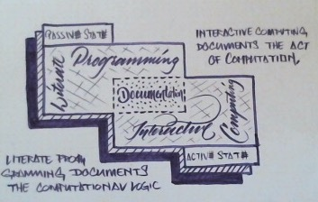
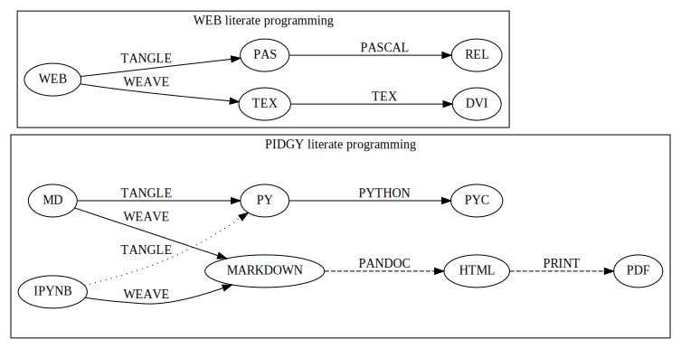
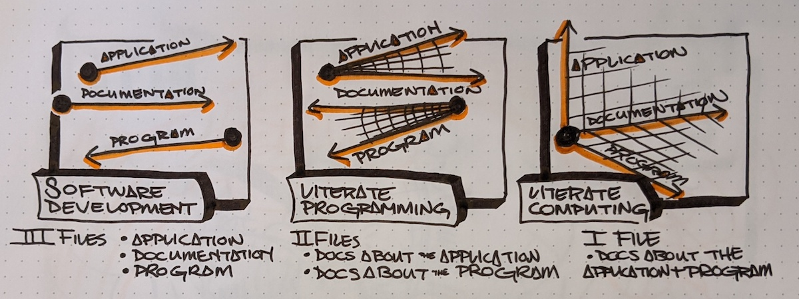
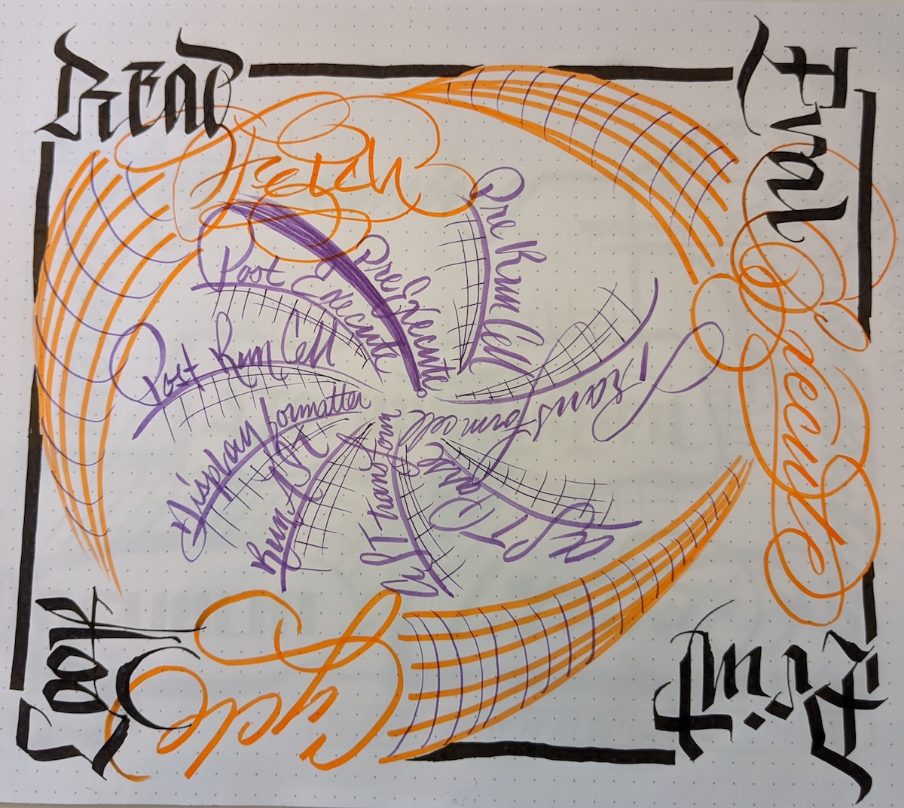

Interactive computing as a medium for modeling ideas as computational literature.

# `pidgy` programming

<!--

    import pidgy, pathlib, nbconvert, IPython

    load = lambda x, level=1: demote(pathlib.Path(x.__file__).read_text(), level)
    demote = lambda x, i: ''.join(
        '#'*i + x if x.startswith('#') else x for x in x.splitlines(True)
    )

    def load(x, level=1):
        file = getattr(x, '__file__', x)
        name = getattr(x, '__name__', x)
        object = demote(
            pathlib.Path(file).read_text()
            if file.endswith('.md')
            else nbconvert.get_exporter('markdown')(exclude_input=True).from_filename(file)[0], level)
        if object.startswith('---'): fm, sep, object = object.lstrip('---').partition('---')

        object = str.replace(object, '# ', F'# [<code>[source]</code>]({pathlib.Path(file).relative_to(pathlib.Path().absolute())})', 1)
        return object


    with pidgy.pidgyLoader(lazy=True):
        import pidgy.pytest_config.readme, pidgy.tests.test_pidgin_syntax, pidgy.tests.test_basic, pidgy.tests.test_repl
        import docs.readme

-->

## [<code>[source]</code>](docs/readme.md)Abstract

`pidgy` presents a fun and expressive interactive literate programming approach
for computational literature, that is also a valid programs.
A literate program is implicitly multilingual, a document formatting language
and programming language are defined as the substrate for the
literate programming language.

The original 1979 implementation defined the [WEB] metalanguage
of [Latex] and [Pascal]. `pidgy` is modern and interactive
take on [Literate Programming] that uses [Markdown] and [Python]
as the respective document and programming languages,
of course we'll add some other bits and bobs.

This conceptual work treats the program as literature and literature
as programs. The result of the `pidgy` implementation is an interactive programming
experience where authors design and program simultaneously in [Markdown].
An effective literate programming will use machine logic to supplement
human logic to explain a program program.
If the document is a valid module (ie. it can restart and run all),
the literate programs can be imported as [Python] modules
then used as terminal applications, web applications,
formal testing object, or APIs. All the while, the program
itself is a readable work of literature as html, pdf.

`pidgy` is written as a literate program using [Markdown]
and [Python].
Throughout this document we'll discuss
the applications and methods behind the `pidgy`
and what it takes to implement a [Literate Programming]
interface in `IPython`.

## Topics

- Literate Programming
- Computational Notebooks
- Markdown
- Python
- Jupyter
- IPython

## Author

[Tony Fast]

<!--

    import __init__ as paper
    import nbconvert, pathlib, click
    file = pathlib.Path(locals().get('__file__', 'readme.md')).parent / 'index.ipynb'

    @click.group()
    def application(): ...

    @application.command()
    def build():
        to = file.with_suffix('.html')
        to.write_text(
            nbconvert.get_exporter('html')(
                exclude_input=True).from_filename(
                    str(file))[0])
        click.echo(F'Built {to}')
    import subprocess


    @application.command()
    @click.argument('files', nargs=-1)
    def push(files):
        click.echo(__import__('subprocess').check_output(
                F"gist -u 2947b4bb582e193f5b2a7dbf8b009b62".split() + list(files)))

    if __name__ == '__main__':
        application() if '__file__' in locals() else application.callback()


-->

[tony fast]: #
[markdown]: #
[python]: #
[jupyter]: #
[ipython]: #

## [<code>[source]</code>](docs/intro.md)Introduction

[Fernando Perez], creator of [`IPython`], wrote an essay titled ["Literate computing" and computational reproducibility]. Here he introduces the term [Literate Computing] that describes a style of workflow where representations of live computation are critical to the understanding of a computational narrative. At the scale of interactive computing, we focus on documenting the computational thinking process using narrative, code, and hypermedia. Whereas [Literate Programming] considers the enduring literary qualities of the program. In this work, we discuss the `pidgy` interactive shell that is designed to improve the [Literate Computing] experience so that the outcome are multi-objective readable, reproducible, and reusable [Literate Program]s.



[Literate Programming] and [Literate Computing] shine light on perspectives on computational thinking as [Documentation]. These concerns represent passive and active states of computational document, literature is the resting state and computing is interactive state. In either condition, `pidgy` prefers the use of Markdown as the interface for composing literate programs. While interactive computing, the input represents both a display object and python code. Interactively writing [Markdown] allows for a fluid intertextuality of `"code"`, hyperlinks, and hypermedia in human logic, an implicit outcome is a [Markdown] document that has literary and computational qualities.

To remain consistent with [Literate Programming], `pidgy` defines the [Tangle] and [Weave] steps that convert the input [Markdown] to their document and program translations. Often [Literate Computing] is used as an informal test of thinking. `pidgy` codifies interactive testing practices that improve the expectation that a [Literate Program] is reusable or reproducible. The [Weave] step in `pidgy` is a enriched with a [Templating Language] that allows computable objects to be embedded and formatted into [Markdown] source.



The [Tangle] step of literate programming converts translates the documentation language into the programming language. The original 1979 [`"WEB"`][web] implementation chose [$\TeX{}$][tex] and [PASCAL], and `pidgy` chooses [Markdown] and [Python]. `pidgy` applies line-for-line heuristics that format `not "code"` blocks into block strings relative block code objects in the literate input.

Before [Weaving] code, `pidgy` executes formal `doctest` and `unittest` discovered by the customized test suite. Testing code interactively helps to ensure that entire documents are reusable as programs. These tests do not hault the program, rather they consider the standard error message to be a feature of readable literature that can communicate exceptions.

To [Weave] a document refers to the transforms made to the input as it becomes a readable object. `pidgy` provides the ability include representation of live programming objects directly in the [Markdown] using `jinja2` syntax. [Markdown] can represent literate programs written in many languages. [Markdown] can include HTML and CSS.


Throughout this work we'll design a purpose built interactive literate computing interface. This work is interested in designing an interactive experience that results in multi-objective computational documents that are readable, reusable, and reproducible over longer timelines than single use notebooks and programs.

The intent of `pidgy` matured as different features began to take form. Originally, `pidgy` was gungho about [Notebooks] being the primary interface for Literate Programming. [Notebooks] provide a metastable serialization of the Literate Programming containing both the literate input and the woven hypermedia. And they still serve valid applications for conditions where the input and output are highly dependent on each other. There are other conditions where we desire to write programmatic literature that is reliably reproducible over a longer timeline. [Markdown] written in `pidgy` seems to provide a compact input for pythonic literate programs with [Markdown] first. If a program is reproducible, then it is input of its outputs.



["literate computing" and computational reproducibility]: http://blog.fperez.org/2013/04/literate-computing-and-computational.html
[tools for the life cycle of a computational idea]: https://sinews.siam.org/Details-Page/jupyter-tools-for-the-life-cycle-of-a-computational-idea
[tex]: #
[web]: #
[pascal]: #
[markdown]: #

## [<code>[source]</code>](pidgy/extension.md)Configuring the [Markdown]-forward interactive shell in `IPython`

This sections registers and describes each of the extensions that `pidgy` applies to the interactive shell.
The implementations of the extension are shaped by existing open source software and practices, and run throughout all aspects of the `pidgy` project. Specifically, this work relies on tooling from the scientific [Python] community.

<!--excerpt-->

`IPython` is a keystone application in the scientific python computing system and is one of the heritage langauges that evolved in the award winning `jupyter` project. The `ipykernel and IPython` are configurable [Python] objects that prescribe how code is executed while interactive computing. The `pidgy` extension is a collection of individual documents that configure individual components of the [Read-Eval-Print-Loop] application.

    import IPython, importnb

Each module in `pidgy` is an `IPython` configuration module that transforms independent aspects of [Literate Computing].

<details><summary>What are the <code>load_ipython_extension and unload_ipython_extension</code> </summary>
`load_ipython_extension and unload_ipython_extension` are used by `IPython` to trigger modifications to the interactive shell by a module. These methods are inovked by the `"load_ext reload_ext unload_ext"` line magics. Demonstrated in the following, the `load_ipython_extension` recieves the current `IPython.InteractiveShell` as an argument to be configured.
</details>

    def load_ipython_extension(shell: IPython.InteractiveShell) -> None:

The `extension` module aggregates the extensions that were designed for `pidgy`.
Currently, `pidgy` defines 6 extensions to produce the enhanced literate programming experience. Each module configures isoluted components of the `IPython.InteractiveShell`.

        with importnb.Notebook():
            try: from . import loader, tangle, extras
            except: import loader, tangle, extras
        with loader.pidgyLoader():
            try: from . import weave, testing, measure
            except: import weave, testing, measure
        ...

- `loader` ensures the ability to important python, markdown, and notebook documents
- `tangle` defines the heuristics for translating [Markdown] to [Python].
- `extras` introduces experimental syntaxes specific to `pidgy`.
- `metadata` retains information as the shell and kernel interact with each other.
- `testing` adds unittest and doctest capabilities to each cell execution.
- `weave` defines a [Markdown] forward display system that templates and displays the input.

        loader.load_ipython_extension(shell)
        tangle.load_ipython_extension(shell)
        measure.load_ipython_extension(shell)
        extras.load_ipython_extension(shell)
        testing.load_ipython_extension(shell)
        weave.load_ipython_extension(shell)


    def unload_ipython_extension(shell):

`unload_ipython_extension` unloads all the extensions loads in `load_ipython_extension`.

        with importnb.Notebook():
            try: from . import loader, tangle, extras
            except: import loader, tangle, extras
        with loader.pidgyLoader():
            try: from . import weave, testing, metadata
            except: import weave, testing, metadata

        [x.unload_ipython_extension(shell) for x in (loader, weave, testing, extras, metadata, tangle)]

[markdown]: #
[literate programming]: #
[`ipython`]: #
[`jupyter`]: #
[kernels]: https://github.com/jupyter/jupyter/wiki/Jupyter-kernels
[`ipython` extensions]: https://ipython.readthedocs.io/en/stable/config/extensions/



## [<code>[source]</code>](pidgy/tests/test_repl.md)Stepping along `IPython`'s [Read-Eval-Print-Loop]

> Sometimes I think the only universal in the computing field is the fetch-execute cycle.
>
> > _Alan Perlis - Perlisisms_

The [Read-Eval-Print-Loop], a fetch-execute cycle, is a familiar interface to execute code and
programs run by a compiler. The `IPython` project orginally began as an
terminal application that was designed to improve the interactive experience
when working [Python]. Eventually, `IPython` moved outside the terminal and
into the browser with `IPython` notebooks that allowed authors that capture
the process of their computational thinking supplemented with supporting
hypermedia.

    import pytest
    @pytest.mark.skipif(not __import__('IPython').get_ipython(), "There is no IPython.")
    def test_ipython_repl():

The body `IPython_REPL` demonstrates that components of the interactive shell that may be configured.

        shell = IPython.get_ipython()

#### Read

`IPython` triggers events when the REPL begins.

        shell.events.callbacks.get('pre_execute'), shell.events.callbacks.get('pre_run_cell')

Once the `input` is read, `IPython` applies a series of strings transformations when the cell is transformed.
The outcome of the transformation should be some that [Python] can `compile`.

        shell.transform_cell, [
            shell.input_transformer_manager.cleanup_transforms,
            shell.input_transformer_manager.line_transforms,
            shell.input_transformer_manager.token_transformers
        ]

The [Python] code is translated into an [Abstract Syntax Tree].

        shell.compile.ast_parse

Transformations to AST are applied by a series of transformers.

        shell.transform_ast, shell.ast_transformers

#### Eval

The `shell` run the body of the [Abstract Syntax Tree] and

        shell.run_ast_nodes, (

#### Print

formats any node meeting the criteria for the ast node interactivity. Typically, the last expression is shown.

        ),shell.ast_node_interactivity, shell.display_formatter.format

`IPython` triggers events when the REPL ends.

        shell.events.callbacks.get('post_run_cell'), shell.events.callbacks.get('post_execute')

#### Loop

### [<code>[source]</code>](pidgy/kernel.md)Configuring the `pidgy` shell and kernel architecture.


Interactive programming in `pidgy` documents is accessed using the polyglot
[Jupyter] kernel architecture. In fact, the provenance the [Jupyter]
name is a combination the native kernel architectures for
[ju~~lia~~][julia], [pyt~~hon~~][python], and [r]. [Jupyter]'s
generalization of the kernel/shell interface allows
over 100 languages to be used in `notebook and jupyterlab`.
It is possible to define prescribe wrapper kernels around existing
methods; this is the appraoach that `pidgy` takes

> A kernel provides programming language support in Jupyter. IPython is the default kernel. Additional kernels include R, Julia, and many more.
>
> > - [`jupyter` kernel definition](https://jupyter.readthedocs.io/en/latest/glossary.html#term-kernel)

`pidgy` is not not a native kernel. It is a wrapper kernel around the
existing `ipykernel and IPython.InteractiveShell` configurables.
`IPython` adds extra syntax to python that simulate literate programming
macros.

<!--

    import jupyter_client, IPython, ipykernel.ipkernel, ipykernel.kernelapp, pidgy, traitlets, pidgy, traitlets, ipykernel.kernelspec, ipykernel.zmqshell, pathlib, traitlets

-->

The shell is the application either jupyterlab or jupyter notebook, the kernel
determines the programming language. Below we design a just jupyter kernel that
can be installed using

- What is the advantage of installing the kernel and how to do it.

```bash
pidgy kernel install
```

#### Configure the `pidgy` shell.

    class pidgyInteractiveShell(ipykernel.zmqshell.ZMQInteractiveShell):

Configure a native `pidgy` `IPython.InteractiveShell`

        loaders = traitlets.Dict(allow_none=True)
        weave = traitlets.Any(allow_none=True)
        tangle = ipykernel.zmqshell.ZMQInteractiveShell.input_transformer_manager
        extras = traitlets.Any(allow_none=True)
        testing = traitlets.Any(allow_none=True)
        measure = traitlets.Any(allow_none=True)
        enable_html_pager = traitlets.Bool(True)

`pidgyInteractiveShell.enable_html_pager` is necessary to see rich displays in
the inspector.

        def __init__(self,*args, **kwargs):
            super().__init__(*args, **kwargs)
            with pidgy.pidgyLoader():
                from .extension import load_ipython_extension
            load_ipython_extension(self)

#### Configure the `pidgy` kernel.

    class pidgyKernel(ipykernel.ipkernel.IPythonKernel):
        shell_class = traitlets.Type(pidgyInteractiveShell)
        _last_parent = traitlets.Dict()

        def init_metadata(self, parent):
            self._last_parent = parent
            return super().init_metadata(parent)


        def do_inspect(self, code, cursor_pos, detail_level=0):

<details><summary>Customizing the Jupyter inspector behavior for literate computing</summary><p>
When we have access to the kernel class it is possible to customize
a number of interactive shell features.   The do inspect function
adds some features to `jupyter`'s  inspection behavior when working in 
`pidgy`.
</p><pre></code>

            object = {'found': False}
            if code[:cursor_pos][-3:] == '!!!':
                object = {'found': True, 'data': {'text/markdown': self.shell.weave.format_markdown(code[:cursor_pos-3]+code[cursor_pos:])}}
            else:
                try:
                    object = super().do_inspect(code, cursor_pos, detail_level=0)
                except: ...

            if not object['found']:

Simulate finding an object and return a preview of the markdown.

                object['found'] = True
                line, offset = IPython.utils.tokenutil.line_at_cursor(code, cursor_pos)
                lead = code[:cursor_pos]
                col = cursor_pos - offset


                code = F"""<code>·L{
                    len(lead.splitlines()) + int(not(col))
                },C{col + 1}</code><br/>\n\n""" + code[:cursor_pos]+'·'+('' if col else '<br/>\n')+code[cursor_pos:]

                object['data'] = {'text/markdown': code}

We include the line number and cursor position to enrich the connection between
the inspector and the source code displayed on another part of the screen.

            return object
        ...

</details>

#### `pidgy`-like interfaces in other languages.

[julia]: #
[r]: #
[python]: #

### [<code>[source]</code>](pidgy/tangle.ipynb)Tangling [Markdown] to [Python]

The `pidgyTransformer` using the existing `IPython.core.inputtransformer2.TransformerManager` to configure the [Markdown] language features, and it is the public API for manipulating `pidgy` strings. It implements the heuristics applied create predictable [Python] from [Markdown]

    class pidgyTransformer(IPython.core.inputtransformer2.TransformerManager, base.Extension):
        def pidgy_transform(self, cell: str) -> str:
            return self.tokenizer.untokenize(self.tokenizer.parse(''.join(cell)))

        def transform_cell(self, cell: str) -> str:
            return super().transform_cell(self.pidgy_transform(cell))
        transform = transform_cell

        def __init__(self, *args, **kwargs):
            super().__init__(*args, **kwargs)
            self.tokenizer = Tokenizer()

        def pidgy_magic(self, *text):
            return IPython.display.Code(self.pidgy_transform(''.join(text)), language='python')

#### The translation process

A convenient considerations when tangling pidgy documents is that we are only concerned with the relative placements of block code objects relative the `not "code"` blocks. `pidgy` customizes `mistune` language features for the purposes of a [Literate Computing] experience. The conversion to [Python] uses:

1. lexical analysis to tokenize the markdown.
2. the token are normalized to block `"code" and not "code"` objects.
3. the tokens are translated to a string using heuristics that maintain line numbers between the representations.

##### Block level lexical analysis.

The block lexer converts a string in tokens that represent blocks of markdown in a text. `pidgy` establishes a modified mistune block lexer that patches some needed features. It includes `doctest` syntax as a language feature. `doctest` are tested interactively, but they are consider `not "code"` objects in the [Markdown] to [Python] translation. `doctest` is added because it is a common documentation approach in [Python], it is an example of [Literate Programming].

<details><summary><code>BlockLexer</code></summary>

    class BlockLexer(markdown.BlockLexer, util.ContextDepth):
        class grammar_class(markdown.BlockGrammar):
            doctest = doctest.DocTestParser._EXAMPLE_RE
            block_code = re.compile(r'^((?!\s+>>>\s) {4}[^\n]+\n*)+')
            default_rules = "newline hrule block_code fences heading nptable lheading block_quote list_block def_links def_footnotes table paragraph text".split()

        def parse_doctest(self, m): self.tokens.append({'type': 'paragraph', 'text': m.group(0)})

        def parse_fences(self, m):
            if m.group(2): self.tokens.append({'type': 'paragraph', 'text': m.group(0)})
            else: super().parse_fences(m)

        def parse_hrule(self, m): self.tokens.append(dict(type='hrule', text=m.group(0)))

        def parse_def_links(self, m):
            super().parse_def_links(m)
            self.tokens.append(dict(type='def_link', text=m.group(0)))

        def parse(self, text: str, default_rules=None, normalize=True) -> typing.List[dict]:
            if not self.depth: self.tokens = []
            with self: tokens = super().parse(util.whiten(text), default_rules)
            if normalize and not self.depth: tokens = normalizer(text, tokens)
            return tokens

        depth = 0
        def __enter__(self): self.depth += 1
        def __exit__(self, *e): self.depth -= 1

<!--

    for x in "default_rules footnote_rules list_rules".split():
        setattr(BlockLexer, x, list(getattr(BlockLexer, x)))
        getattr(BlockLexer, x).insert(getattr(BlockLexer, x).index('block_code'), 'doctest')
        if 'block_html' in getattr(BlockLexer, x):
            getattr(BlockLexer, x).pop(getattr(BlockLexer, x).index('block_html'))


-->

</details>

##### Normalizing the tokens

This extra step flattens the canonical mistune token representation to the collection of `"code" and not "code"` tokens.

<details><summary><code>normalizer</code></summary>

    def normalizer(text, tokens):
        """Combine non-code tokens into contiguous blocks."""
        compacted = []
        while tokens:
            token = tokens.pop(0)
            if 'text' not in token: continue
            else:
                if not token['text'].strip(): continue
                block, body = token['text'].splitlines(), ""
            while block:
                line = block.pop(0)
                if line:
                    before, line, text = text.partition(line)
                    body += before + line
            if token['type']=='code':
                compacted.append({'type': 'code', 'lang': None, 'text': body})
            else:
                if compacted and compacted[-1]['type'] == 'paragraph':
                    compacted[-1]['text'] += body
                else: compacted.append({'type': 'paragraph', 'text': body})
        if compacted and compacted[-1]['type'] == 'paragraph':
            compacted[-1]['text'] += text
        elif text.strip():
            compacted.append({'type': 'paragraph', 'text': text})
        # Deal with front matter
        if compacted[0]['text'].startswith('---\n') and '\n---' in compacted[0]['text'][4:]:
            token = compacted.pop(0)
            front_matter, sep, paragraph = token['text'][4:].partition('---')
            compacted = [{'type': 'front_matter', 'text': F"\n{front_matter}"},
                        {'type': 'paragraph', 'text': paragraph}] + compacted
        return compacted

</details>

##### Flattening the tokens to a [Python] string.

The tokenizer controls the translation of markdown strings to python strings. Our major constraint is that the Markdown input should retain line numbers.

<details><summary><code>Flatten</code></summary>

    class Tokenizer(BlockLexer):
        def untokenize(self, tokens: typing.List[dict], source: str = """""", last: int =0) -> str:
            INDENT = indent = util.base_indent(tokens) or 4
            for i, token in enumerate(tokens):
                object = token['text']
                if token and token['type'] == 'code':
                    if object.lstrip().startswith(FENCE):

                        object = ''.join(''.join(object.partition(FENCE)[::2]).rpartition(FENCE)[::2])
                        indent = INDENT + util.num_first_indent(object)
                        object = textwrap.indent(object, INDENT*SPACE)

                    if object.lstrip().startswith(MAGIC):  ...
                    else: indent = util.num_last_indent(object)
                elif token and token['type'] == 'front_matter':
                    object = textwrap.indent(
                        F"locals().update(__import__('yaml').safe_load({util.quote(object)}))\n", indent*SPACE)

                elif not object: ...
                else:
                    object = textwrap.indent(object, SPACE*max(indent-util.num_first_indent(object), 0))
                    for next in tokens[i+1:]:
                        if next['type'] == 'code':
                            next = util.num_first_indent(next['text'])
                            break
                    else: next = indent
                    Δ = max(next-indent, 0)

                    if not Δ and source.rstrip().rstrip(CONTINUATION).endswith(COLON):
                        Δ += 4

                    spaces = util.num_whitespace(object)
                    "what if the spaces are ling enough"
                    object = object[:spaces] + Δ*SPACE+ object[spaces:]
                    if not source.rstrip().rstrip(CONTINUATION).endswith(QUOTES):
                        object = util.quote(object)
                source += object

            # add a semicolon to the source if the last block is code.
            for token in reversed(tokens):
                if token['text'].strip():
                    if token['type'] != 'code':
                        source = source.rstrip() + SEMI
                    break

            return source

</details>

##### Normalizing the tokens

This step may be superfluous, but it assisted in considering the logic necessary to compose the resulting python. This extra step flattens the canonical mistune token representation is reduced to one of `"paragraph code front_matter"` tokens.

</details>

<details><summary>Utility functions for the tangle module</summary>

    def normalizer(text: str, tokens: typing.List[dict]):
        """Combine non-code tokens into contiguous blocks."""
        compacted = []
        while tokens:
            token = tokens.pop(0)
            if 'text' not in token: continue
            else:
                if not token['text'].strip(): continue
                block, body = token['text'].splitlines(), ""
            while block:
                line = block.pop(0)
                if line:
                    before, line, text = text.partition(line)
                    body += before + line
            if token['type']=='code':
                compacted.append({'type': 'code', 'lang': None, 'text': body})
            else:
                if compacted and compacted[-1]['type'] == 'paragraph':
                    compacted[-1]['text'] += body
                else: compacted.append({'type': 'paragraph', 'text': body})
        if compacted and compacted[-1]['type'] == 'paragraph':
            compacted[-1]['text'] += text
        elif text.strip():
            compacted.append({'type': 'paragraph', 'text': text})

        if compacted[0]['text'].startswith('---\n') and '\n---' in compacted[0]['text'][4:]:
            token = compacted.pop(0)
            front_matter, sep, paragraph = token['text'][4:].partition('---')
            compacted = [{'type': 'front_matter', 'text': F"\n{front_matter}"},
                        {'type': 'paragraph', 'text': paragraph}] + compacted
        return compacted

</details>

    def load_ipython_extension(shell):
        shell.tangle = pidgyTransformer().register(shell)

    def unload_ipython_extension(shell):
        if hasattr(shell, 'tangle'): shell.tangle.unregister(shell)

    (FENCE, CONTINUATION, SEMI, COLON, MAGIC, DOCTEST), QUOTES, SPACE ='``` \\ ; : %% >>>'.split(), ('"""', "'''"), ' '
    WHITESPACE = re.compile('^\s*', re.MULTILINE)

    def unload_ipython_extension(shell):
        if hasattr(shell, 'tangle'): shell.tangle.unregister(shell)

    (FENCE, CONTINUATION, SEMI, COLON, MAGIC, DOCTEST), QUOTES, SPACE ='``` \\ ; : %% >>>'.split(), ('"""', "'''"), ' '
    WHITESPACE = re.compile('^\s*', re.MULTILINE)

<!--

    for x in "default_rules footnote_rules list_rules".split():
        setattr(BlockLexer, x, list(getattr(BlockLexer, x)))
        getattr(BlockLexer, x).insert(getattr(BlockLexer, x).index('block_code'), 'doctest')
        if 'block_html' in getattr(BlockLexer, x):
            getattr(BlockLexer, x).pop(getattr(BlockLexer, x).index('block_html'))


-->

</summary></details>

## Applications

### [<code>[source]</code>](pidgy/loader.ipynb)Importing and reusing `pidgy` literature

A constraint consistent across most programming languages is that
programs are executed line-by-line without any
statements or expressions. raising exceptions
If literate programs have the computational quality that they **restart
and run all** the they should
When `pidgy` programs have this quality they can <code>import</code> in [Python], they become importable essays or reports.

    __all__ = 'pidgyLoader',; import pidgy, IPython, importnb

The `pidgyLoader` customizes [Python]'s ability to discover
[Markdown] and `pidgy` [Notebook]s have the composite `".md.ipynb"` extension.
`importnb` provides a high level API for modifying how content
[Python] imports different file types.

`sys.meta_path and sys.path_hooks`

    class pidgyLoader(importnb.Notebook):
        extensions = ".py.md .md .md.ipynb".split()

`get_data` determines how a file is decoding from disk. We use it to make an escape hatch for markdown files otherwise we are importing a notebook.

    def get_data(self, path):
        if self.path.endswith('.md'): return self.code(self.decode())
        return super(pidgyLoader, self).get_data(path)

The `code` method tangles the [Markdown] to [Python] before compiling to an [Abstract Syntax Tree].

    def code(self, str):
        with importnb.Notebook():
            try: from . import tangle, extras
            except: import tangle, extras
        return ''.join(extras.demojize(''.join(tangle.pidgyTransformer().transform_cell(str))))

The `visit` method allows custom [Abstract Syntax Tree] transformations to be applied.

    def visit(self, node):
        with importnb.Notebook():
            try: from . import extras
            except: import extras
        return extras.ExtraSyntax().visit(node)

Attach these methods to the `pidgy` loader.

    pidgyLoader.code, pidgyLoader.visit = code, visit
    pidgyLoader.get_source = pidgyLoader.get_data = get_data

Collect all of the functions defined into the `pidgyLoader`.

The `pidgy` `loader` configures how [Python] discovers modules when they are
imported.
Usually the loader is used as a content manager and in this case we hold the enter
the context, but do not leave it until `unload_ipython_extension` is executed.

-->

    def load_ipython_extension(shell, loader=pidgyLoader):
        setattr(shell, 'loaders', getattr(shell, 'loaders', {}))
        shell.loaders[pidgyLoader] = loader(position=-1)
        shell.loaders[pidgyLoader].__enter__()

<!--


<!--

    def unload_ipython_extension(shell, loader=pidgyLoader):
        loader = shell.loaders.pop(pidgyLoader)
        loader and loader.__exit__(None, None, None)

-->

### [<code>[source]</code>](pidgy/pytest_config/readme.md)Literature as the test

    import pidgy, pytest, nbval, doctest, importnb.utils.pytest_importnb

Literate documents can be motivated by the need to test a concept. In a fact, a common
use case of notebooks is that they interactively test units of thought. Often the thought
of reusability is an after thought.

`pidgy` documents are meant to be treated as test objects. In fact, the `pidgy` test suite
executed by `pytest` through [Github Actions][actions] uses `pidgy` notebooks (ie. documents with the `".md" or ".md.ipynb"` extension). `pidgy` supplies its own `pytest` extensions, and it uses [`nbval`][nbval] and the `pytest`"--doctest-modules"`flag. With these conditions we discover pytest conventions, unitests, doctests, and options cell input output validated. Ultimately,`pidgy` documents may represent units of literate that double as formal test objects.

The document accessed by the `"pytest11"` console_script and includes the extension with a pytest runner.

    class pidgyModule(importnb.utils.pytest_importnb.NotebookModule):

The `pidgyModule` derives from an existing `pytest` extension that extracts formal tests from `notebook`s
as if they were regular python files. We'll use the `pidgy.pidgyLoader` to load Markdown-forward documents
as python objects.

        loader = pidgy.pidgyLoader

    class pidgyTests(importnb.utils.pytest_importnb.NotebookTests):

`pidgyTests` makes sure to include the alternative source formats to tangle to python executions.

        modules = pidgyModule,

[nbval]: https://github.com/computationalmodelling/nbval/ "The pidgy kernel works directly with `nbval`."
[actions]: https://github.com/deathbeds/pidgy/runs/478462971

### [<code>[source]</code>](pidgy/readme.md)`"readme.md"` is a good name for a file.

> [**Eat Me, Drink Me, Read Me.**][readme history]

In `pidgy`, the `"readme.md"` is treated as the description and implementation
of the `__main__` program. The code below outlines the `pidgy` command line
application to reuse literate `pidgy` documents in `markdown` and `notebook`
files. It outlines how static `pidgy` documents may be reused outside of the
interactive context.

<!--excerpt-->

    ...

<!--

    import click, IPython, pidgy, nbconvert, pathlib, re

-->

    @click.group()
    def application()->None:

The `pidgy` `application` will group together a few commands that can view,
execute, and test pidgy documents.

<!---->

#### `"pidgy run"` literature as code

    @application.command(context_settings=dict(allow_extra_args=True))
    @click.option('--verbose/--quiet', default=True)
    @click.argument('ref', type=click.STRING)
    @click.pass_context
    def run(ctx, ref, verbose):

`pidgy` `run` makes it possible to execute `pidgy` documents as programs, and
view their pubished results.

        import pidgy, importnb, runpy, sys, importlib, jinja2
        comment = re.compile(r'(?s:<!--.*?-->)')
        absolute = str(pathlib.Path().absolute())
        sys.path = ['.'] + sys.path
        with pidgy.pidgyLoader(main=True), importnb.Notebook(main=True):
            click.echo(F"Running {ref}.")
            sys.argv, argv = [ref] + ctx.args, sys.argv
            try:
                if pathlib.Path(ref).exists():
                    for ext in ".py .ipynb .md".split(): ref = ref[:-len(ext)] if ref[-len(ext):] == ext else ref
                if ref in sys.modules:
                    with pidgy.pidgyLoader(): # cant reload main
                        object = importlib.reload(importlib.import_module(ref))
                else: object = importlib.import_module(ref)
                if verbose:
                    md = (nbconvert.get_exporter('markdown')(
                        exclude_output=object.__file__.endswith('.md.ipynb')).from_filename(object.__file__)[0]
                            if object.__file__.endswith('.ipynb')
                            else pathlib.Path(object.__file__).read_text())
                    md = re.sub(comment, '', md)
                    click.echo(
                        jinja2.Template(md).render(vars(object)))
            finally: sys.argv = argv

<!---->

#### Test `pidgy` documents in pytest.

    @application.command(context_settings=dict(allow_extra_args=True))
    @click.argument('files', nargs=-1, type=click.STRING)
    @click.pass_context
    def test(ctx, files):

Formally test markdown documents, notebooks, and python files.

         import pytest
         pytest.main(ctx.args+['--doctest-modules', '--disable-pytest-warnings']+list(files))

<!---->

#### Install `pidgy` as a known kernel.

    @application.group()
    def kernel():

`pidgy` is mainly designed to improve the interactive experience of creating
literature in computational notebooks.

<!---->

    @kernel.command()
    def install(user=False, replace=None, prefix=None):

`install` the pidgy kernel.

        manager = __import__('jupyter_client').kernelspec.KernelSpecManager()
        path = str((pathlib.Path(__file__).parent / 'kernelspec').absolute())
        try:
            dest = manager.install_kernel_spec(path, 'pidgy')
        except:
            click.echo(F"System install was unsuccessful. Attempting to install the pidgy kernel to the user.")
            dest = manager.install_kernel_spec(path, 'pidgy', True)
        click.echo(F"The pidgy kernel was install in {dest}")

<!--

    @kernel.command()
    def uninstall(user=True, replace=None, prefix=None):

`uninstall` the kernel.

        import jupyter_client
        jupyter_client.kernelspec.KernelSpecManager().remove_kernel_spec('pidgy')
        click.echo(F"The pidgy kernel was removed.")


    @kernel.command()
    @click.option('-f')
    def start(user=True, replace=None, prefix=None, f=None):

Launch a `pidgy` kernel applications.

        import ipykernel.kernelapp
        with pidgy.pidgyLoader():
            from . import kernel
        ipykernel.kernelapp.IPKernelApp.launch_instance(
            kernel_class=kernel.pidgyKernel)
    ...

-->

[art of the readme]: https://github.com/noffle/art-of-readme
[readme history]: https://medium.com/@NSomar/readme-md-history-and-components-a365aff07f10

## Methods

### [<code>[source]</code>](pidgy/weave.md)Weaving cells in pidgin programs

<!--

    import dataclasses, IPython, nbconvert as convert, jinja2
    try: from . import base, util
    except: import base, util
    exporter = convert.exporters.TemplateExporter()

-->

pidgin programming is an incremental approach to documents.

    @dataclasses.dataclass
    class Weave(base.Extension):
        environment: jinja2.Environment = dataclasses.field(default=exporter.environment)

        def format_markdown(self, text):
            lines = text.splitlines() or ['']
            if not lines[0].strip(): return F"""<!--\n{text}\n\n-->"""
            try:
                template = exporter.environment.from_string(text, globals=getattr(self.shell, 'user_ns', {}))
                text = template.render()
            except BaseException as Exception:
                self.shell.showtraceback((type(Exception), Exception, Exception.__traceback__))
            return text

        def format_metadata(self):
            parent = getattr(self.shell.kernel, '_last_parent', {})
            return {}

        def _update_filters(self):
            self.environment.filters.update({
                k: v for k, v in getattr(self.shell, 'user_ns', {}).items() if callable(v) and k not in self.environment.filters})


        def post_run_cell(self, result):
            text = util.strip_front_matter(result.info.raw_cell)
            IPython.display.display(IPython.display.Markdown(self.format_markdown(text), metadata=self.format_metadata()))
            return result

    def load_ipython_extension(shell):
        shell.weave = Weave(shell=shell)
        shell.weave.register()


    def unload_ipython_extension(shell):
        try:
            shell.weave.unregister()
        except:...

#### [<code>[source]</code>](pidgy/extras.ipynb)Extra langauge features of `pidgy`

`pidgy` experiments extra language features for python, using the same system
that IPython uses to add features like line and cell magics.

<!--


    import IPython, typing as τ, mistune as markdown, IPython, importnb as _import_, textwrap, ast, doctest, typing, re
    import dataclasses, ast, pidgy
    with pidgy.pidgyLoader(lazy=True):
        try: from . import events
        except: import events


-->

##### naming variables with gestures.

We know naming is hard, there is no point focusing on it. `pidgy` allows authors
to use emojis as variables in python. They add extra color and expression to the narrative.

    def demojize(lines, delimiters=('_', '_')):
        str = ''.join(lines)
        import tokenize, emoji, stringcase; tokens = []
        try:
            for token in list(tokenize.tokenize(
                __import__('io').BytesIO(str.encode()).readline)):
                if token.type == tokenize.ERRORTOKEN:
                    string = emoji.demojize(token.string, delimiters=delimiters
                                           ).replace('-', '_').replace("’", "_")
                    if tokens and tokens[-1].type == tokenize.NAME: tokens[-1] = tokenize.TokenInfo(tokens[-1].type, tokens[-1].string + string, tokens[-1].start, tokens[-1].end, tokens[-1].line)
                    else: tokens.append(
                        tokenize.TokenInfo(
                            tokenize.NAME, string, token.start, token.end, token.line))
                else: tokens.append(token)
            return tokenize.untokenize(tokens).decode().splitlines(True)
        except BaseException: raise SyntaxError(str)

##### Top level return and yield statements.

<!--


    def unload_ipython_extension(shell):
        shell.extras.unregister()


-->

### [<code>[source]</code>](pidgy/testing.md)Interactive testing of literate programs

Testing is something we added because of the application of notebooks as test units.

A primary use case of notebooks is to test ideas. Typically this in informally using
manual validation to qualify the efficacy of narrative and code. To ensure testable literate documents
we formally test code incrementally during interactive computing.

<!--

    import unittest, doctest, textwrap, dataclasses, IPython, re, pidgy, sys, typing, types, contextlib, ast, inspect
    with pidgy.pidgyLoader(lazy=True):
        try: from . import events
        except: import events

-->

    def make_test_suite(*objects: typing.Union[
        unittest.TestCase, types.FunctionType, str
    ], vars, name) -> unittest.TestSuite:

The interactive testing suite execute `doctest and unittest` conventions
for a flexible interface to verifying the computational qualities of literate programs.

        suite, doctest_suite = unittest.TestSuite(), doctest.DocTestSuite()
        suite.addTest(doctest_suite)
        for object in objects:
            if isinstance(object, type) and issubclass(object, unittest.TestCase):
                suite.addTest(unittest.defaultTestLoader.loadTestsFromTestCase(object))
            elif isinstance(object, str):
                doctest_suite.addTest(doctest.DocTestCase(
                doctest.DocTestParser().get_doctest(object, vars, name, name, 1), doctest.ELLIPSIS))
                doctest_suite.addTest(doctest.DocTestCase(
                InlineDoctestParser().get_doctest(object, vars, name, name, 1), checker=NullOutputCheck))
            elif inspect.isfunction(object):
                suite.addTest(unittest.FunctionTestCase(object))
        return suite

    @dataclasses.dataclass
    class Testing(events.Events):

The `Testing` class executes the test suite each time a cell is executed.

        function_pattern: str = 'test_'
        def post_run_cell(self, result):
            globs, filename = self.shell.user_ns, F"In[{self.shell.last_execution_result.execution_count}]"

            if not (result.error_before_exec or result.error_in_exec):
                with ipython_compiler(self.shell):
                    definitions = [self.shell.user_ns[x] for x in getattr(self.shell.measure, 'definitions', [])
                        if x.startswith(self.function_pattern) or
                        (isinstance(self.shell.user_ns[x], type)
                         and issubclass(self.shell.user_ns[x], unittest.TestCase))
                    ]
                    result = self.run(make_test_suite(result.info.raw_cell, *definitions, vars=self.shell.user_ns, name=filename), result)


        def run(self, suite: unittest.TestCase, cell) -> unittest.TestResult:
            result = unittest.TestResult(); suite.run(result)
            if result.failures:
                msg = '\n'.join(msg for text, msg in result.failures)
                msg = re.sub(re.compile("<ipython-input-[0-9]+-\S+>"), F'In[{cell.execution_count}]', clean_doctest_traceback(msg))
                sys.stderr.writelines((str(result) + '\n' + msg).splitlines(True))
                return result

    @contextlib.contextmanager
    def ipython_compiler(shell):

We'll have to replace how `doctest` compiles code with the `IPython` machinery.

        def compiler(input, filename, symbol, *args, **kwargs):
            nonlocal shell
            return shell.compile(
                ast.Interactive(
                    body=shell.transform_ast(
                    shell.compile.ast_parse(shell.transform_cell(textwrap.indent(input, ' '*4)))
                ).body),
                F"In[{shell.last_execution_result.execution_count}]",
                "single",
            )

        yield setattr(doctest, "compile", compiler)
        doctest.compile = compile

    def clean_doctest_traceback(str, *lines):
        str = re.sub(re.compile("""\n\s+File [\s\S]+, line [0-9]+, in runTest\s+raise[\s\S]+\([\s\S]+\)\n?"""), '\n', str)
        return re.sub(re.compile("Traceback \(most recent call last\):\n"), '', str)

<details><summary>Utilities for the testing module.</summary>
    
    class NullOutputCheck(doctest.OutputChecker):
        def check_output(self, *e): return True

    class InlineDoctestParser(doctest.DocTestParser):
        _EXAMPLE_RE = re.compile(r'`(?P<indent>\s{0})'
    r'(?P<source>[^`].*?)'
    r'`')
        def _parse_example(self, m, name, lineno): return m.group('source'), None, "...", None


    def load_ipython_extension(shell):
        shell.testing = Testing(shell=shell).register()

    def unload_ipython_extension(shell):
        shell.testing.unregister()

</details>

### [<code>[source]</code>](pidgy/measure.md)Measure activities during the interactive compute process

To an organization, human compute time bears an important cost
and programming represents a small part of that cycle.

    def load_ipython_extension(shell):

The `metadata` module assists in collecting metadata about the interactive compute process.
It appends the metadata atrribute to the shell.

        shell.measure = Measure(shell=shell).register()

<!--

    import dataclasses, ast, pidgy
    with pidgy.pidgyLoader(lazy=True):
        try: from . import events
        except: import events

-->

    @dataclasses.dataclass
    class Measure(events.Events, ast.NodeTransformer):
        definitions: list = dataclasses.field(default_factory=list)
        def pre_execute(self):
            self.definitions = []

        def visit_FunctionDef(self, node):
            self.definitions.append(node.name)
            return node

        visit_ClassDef = visit_FunctionDef

<!--

    def unload_ipython_extension(shell):
        shell.metadata.unregister()

-->

{{load('readme.md')}}

## Appendix

[Python] files and notebooks typically represent appendix files.

### `pidgy` base extension registration.

```python
import IPython, ast, dataclasses, functools, importnb


@dataclasses.dataclass
class Extension:
    """`Extension` is base class that simplifies loading and unloading IPython extensions. Each component of `pidgy` is an IPython extension are this work compacts some repetative practices."""

    _repl_events = "pre_execute pre_run_cell post_execute post_run_cell".split()
    shell: IPython.InteractiveShell = dataclasses.field(
        default_factory=IPython.get_ipython
    )

    def register(self, shell=None, *, method=""):
        if shell:
            self.shell = shell
        register, unregister = not bool(method), bool(method)
        shell = self.shell
        for event in self._repl_events:
            callable = getattr(self, event, None)
            callable and getattr(shell.events, f"{method}register")(event, callable)
        if isinstance(self, ast.NodeTransformer):
            register and shell.ast_transformers.append(self)
            unregister and shell.ast_transformers.pop(
                shell.ast_transformers.index(self)
            )

            if isinstance(self, IPython.core.inputtransformer2.TransformerManager):
                if register:
                    shell.input_transformer_manager = self
                if unregister:
                    shell.input_transformer_managers = (
                        IPython.core.inputtransformer2.TransformerManager()
                    )

        return self

    unregister = functools.partialmethod(register, method="un")

```

### `pidgy` utilities.

````python
import re, typing


class ContextDepth:
    depth = 0

    def __enter__(self):
        self.depth += 1

    def __exit__(self, *e):
        self.depth -= 1


(FENCE, CONTINUATION, SEMI, COLON, MAGIC, DOCTEST), QUOTES, SPACE = (
    "``` \\ ; : %% >>>".split(),
    ('"""', "'''"),
    " ",
)
WHITESPACE = re.compile("^\s*", re.MULTILINE)


def num_first_indent(text: str) -> int:
    for str in text.splitlines():
        if str.strip():
            return len(str) - len(str.lstrip())
    return 0


def num_last_indent(text: str) -> int:
    for str in reversed(text.splitlines()):
        if str.strip():
            return len(str) - len(str.lstrip())
    return 0


def base_indent(tokens: typing.List[dict]) -> int:
    "Look ahead for the base indent."
    for i, token in enumerate(tokens):
        if token["type"] == "code":
            code = token["text"]
            if code.lstrip().startswith(FENCE):
                continue
            indent = num_first_indent(code)
            break
    else:
        indent = 4
    return indent


def quote(text: str) -> str:
    """wrap text in `QUOTES`"""
    if text.strip():
        left, right = len(text) - len(text.lstrip()), len(text.rstrip())
        quote = QUOTES[(text[right - 1] in QUOTES[0]) or (QUOTES[0] in text)]
        return text[:left] + quote + text[left:right] + quote + text[right:]
    return text


def num_whitespace(text: str) -> int:
    return len(text) - len(text.lstrip())


def whiten(text: str) -> str:
    """`whiten` strips empty lines because the `markdown.BlockLexer` doesn't like that."""
    return "\n".join(x.rstrip() for x in text.splitlines())


def strip_front_matter(text, sep=None):
    if text.startswith("---\n"):
        front_matter, sep, rest = text[4:].partition("\n---")
    if sep:
        return "".join(rest.splitlines(True)[1:])
    return text

````

<!--

    [NbConvertApp] Converting notebook index.md.ipynb to markdown


    # NBVAL_SKIP


    if __name__ == '__main__' and not '__file__' in globals():
        !jupyter nbconvert --to markdown --stdout --TemplateExporter.exclude_input=True index.md.ipynb > docs/index.md

-->
