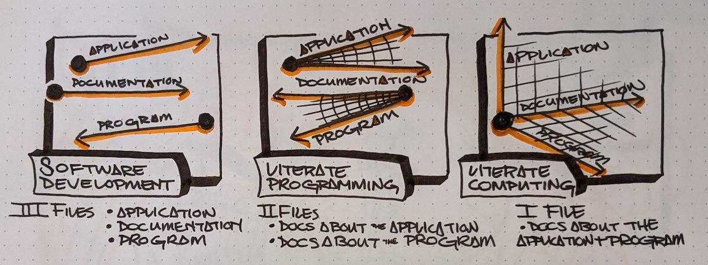

# Introduction

[Fernando Perez], creator of [`IPython`], wrote an essay titled ["Literate computing" and computational reproducibility]. In it he introduces the term [Literate Computing] that describes a style of workflow where representations of live computation are critical to a computational narrative. At the speed of interactive computing, we focus on documenting the computational thinking process using narrative, code, and hypermedia. Whereas [Literate Programming] considers the enduring literary qualities of the program. In this work, we discuss the `pidgy` interactive shell that is designed to provide a [Literate Computing] experience so that results in multi-objective readable, reproducible, and reusable [Literate Program]s.

[Literate Programming] and [Literate Computing] shine light on perspectives on computational thinking as [Documentation]. These concerns represent passive and active states of computational document, literature is the resting state and computing is interactive state. In either condition, `pidgy` prefers the use of Markdown as the interface for composing literate programs. While interactive computing, the input represents both a display object and python code. Interactively writing [Markdown] allows for a fluid intertextuality of `"code"`, hyperlinks, and hypermedia in human logic, an implicit outcome is a [Markdown] document that has literary and computational qualities.

To remain consistent with [Literate Programming], `pidgy` defines the [Tangle] and [Weave] steps that convert the input [Markdown] to their document and program translations. Often [Literate Computing] is used as an informal test of thinking. `pidgy` codifies interactive testing practices that improve the expectation that a [Literate Program] is reusable or reproducible. The [Weave] step in `pidgy` is a enriched with a [Templating Language] that allows computable objects to be embedded and formatted into [Markdown] source.

The [Tangle] step of literate programming converts translates the documentation language into the programming language. The original 1979 [`"WEB"`][web] implementation chose [$\TeX{}$][tex] and [PASCAL], and `pidgy` chooses [Markdown] and [Python]. `pidgy` applies line-for-line heuristics that format `not "code"` blocks into block strings relative block code objects in the literate input.

Before [Weaving] code, `pidgy` executes formal `doctest` and `unittest` discovered by the customized test suite. Testing code interactively helps to ensure that entire documents are reusable as programs. These tests do not hault the program, rather they consider the standard error message to be a feature of readable literature that can communicate exceptions.

To [Weave] a document refers to the transforms made to the input as it becomes a readable object. `pidgy` provides the ability include representation of live programming objects directly in the [Markdown] using `jinja2` syntax. [Markdown] can represent literate programs written in many languages. [Markdown] can include HTML and CSS.

Throughout this work we'll design a purpose built interactive literate computing interface. This work is interested in designing an interactive experience that results in multi-objective computational documents that are readable, reusable, and reproducible over longer timelines than single use notebooks and programs.
A consistent theme is that all interactions were designed for `jupyter`, and as a result end-user of `jupyter` kernels like colab and vscode can use `pidgy`.
The intent of `pidgy` matured as different features began to take form. Originally, `pidgy` was gungho about [Notebooks] being the primary interface for Literate Programming. [Notebooks] provide a metastable serialization of the Literate Programming containing both the literate input and the woven hypermedia. And they still serve valid applications for conditions where the input and output are highly dependent on each other. There are other conditions where we desire to write programmatic literature that is reliably reproducible over a longer timeline. [Markdown] written in `pidgy` seems to provide a compact input for pythonic literate programs with [Markdown] first. If a program is reproducible, then it is input of its outputs.

["literate computing" and computational reproducibility]: http://blog.fperez.org/2013/04/literate-computing-and-computational.html
[tools for the life cycle of a computational idea]: https://sinews.siam.org/Details-Page/jupyter-tools-for-the-life-cycle-of-a-computational-idea
[tex]: #
[web]: #
[pascal]: #
[markdown]: #
[fernando perez]: #
[literate computing]: #
[notebooks]: #
[literate programming]: #
[`ipython`]: #
[literate program]: #
[documentation]: #
[tangle]: #
[weave]: #
