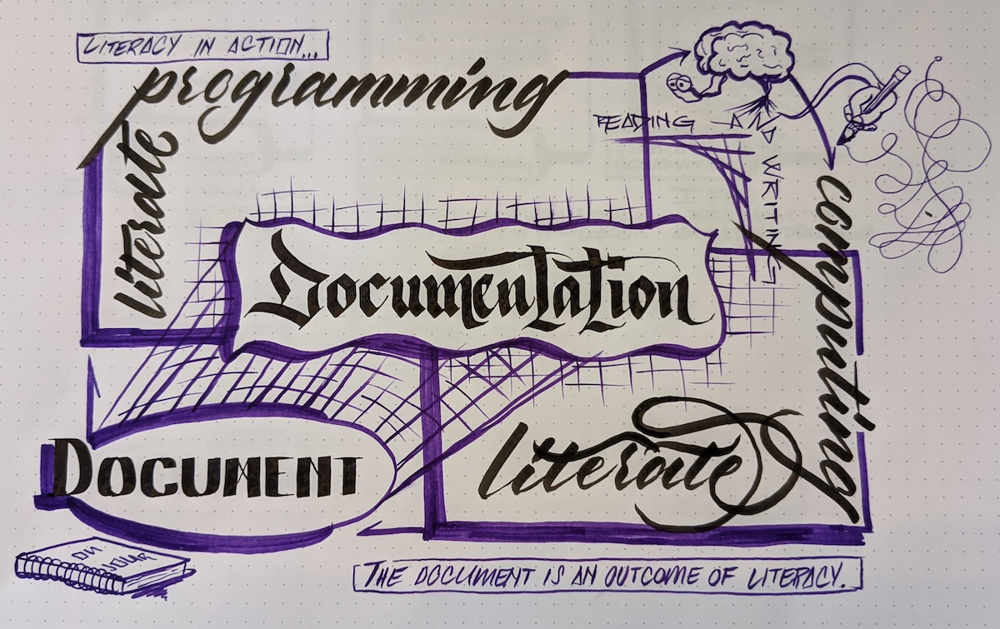

The rise of data-driven occupations has brought a specific skill in using interactive development envelopes to
extract value from increasing volumes of information. `jupyter` and `python` have become popular
tooling in academia and industry for testing and communicating computational thought. The `jupyter` `notebook`
has become a popular documentation tool for data-driven inquiries. `notebook`s are useful for documentation because they establish two languages: [Markdown] for narrative and some programming language for computing.

The `notebook` format establishes a document formatting language and programming language, which are the basic requirements for a literate program. The original [Literate Programming] paper was published in 1979 as a prescient idea for composing documentation and programs as literature. The first web implementation specification Latex and pascal as the respective langaguges.
`jupyter` is propelled by a generalized interface for interactive computing that is language agnostic. Therefore, `jupyter`
notebooks permits literate programming for many programming, but is restricted to the Markdown documentation language.

This work, the `pidgy` specification and implementation, demonstrates [Literate Computing] in the `jupyter` ecosystem. Fernando Perez, creator of IPython, wrote an essay about ["Literate computing" and computational reproducibility] that identifies differences between in the act of authoring computational documents versus the intent of the resting document. Despite the differences, `pidgy` identifies [Documentation] as the overlapping features of [Literate Programming] & [Interactive Computing]. When working in `pidgy`, units of code and narrative co-develop using [Markdown] as the input language. The primary heuristic behind the [Markdown] to [Python] translation is that `"code"`` blocks are to be executed and the narrative is cast as a string
and indented.

`pidgy` is consistent with [Literate Programming] by defining tangle and weave steps. And, it places another focus on the veracity of the code in the document. It provides access to a formal testing methods that very the efficacy of code within the narrative. One mode of a testing is [`doctest`] (ie. documentation testing.) with is a convention for literate programming in documentation that can be verified by a test suite. Interactive testing formalizes conventional manual testing practices that drive data-driven insight.

In `pidgy` code has equity in the narrative. There are no boundaries between narrative and code which has been a long withstanding challenge of the notebook with strict boundaries between the documentation language and programming language. [Markdown] allows multiple for conventions for creating code objects in a narrative. `pidgy` tests all these code objects including the inline code. The use of code as an equitable symbol in the narrative reinforces the intertextuality of the literate and computation. They are enriched signifiers that provide an element of verifiability.

The year following the [Literate Programming] publications, Ted Nelson presented in the idea of transclusion in his paper titled [Literary Machines]. Transclusion is the ability include one document within another. `pidgy` introduces these abilities in the weaving steps using `jinja2` template syntax.
Objects with the working interactive computing session can be represented by a resulting document.

In `pidgy`, everything is [Markdown] including code cells in the notebook. As a result, each of the major cell types in the notebook is Markdown and the type indicative of whether it is on or off.
Considering a single language specification across the entire notebooks makes it easier to consider the document as a whole.

As a result, if `pidgy` documents **restart and run all** then they may be used in multiple computational contexts including python modules, formal python tests, or command line applications.

The `notebook` defines . Effectively, making the
the languages independent of each other when potentially these languages could interact at varying degress. In software and scientific communities, programming languages are becoming components of natural language to communicate the relationship between code and its meaning. Currently, the `notebook` lacks ability to embed code as intertextual relationships directly in the narrative.

The `notebook` format is a data serialization format for literate programs, it is not specifically a document format, it is a generalized data structure that can be consumed by nearly all other programming languages. Software systems can reliably reuse the notebook schema to build static and interactive applications around computational thinking.

["literate computing" and computational reproducibility]: http://blog.fperez.org/2013/04/literate-computing-and-computational.html
