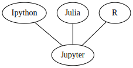

`rites` is a collection of IPython magics for creating computable essays.

[](https://mybinder.org/v2/gh/deathbeds/rites/master?filepath=readme.ipynb)


```python
    %load_ext rites
```

# Markdown Mode


```python
    %rites markdown 
```


```python
---
With `rites.markdown`, code cells accept markdown.  Any indented code blocks are executed.

    foo = 42
    print(f"foo is {foo}")

> Accepting the `rites.markdown` convetion means the author agrees to indent all their code at least once; and sometimes more in nested lists. 

---
```


---
With `rites.markdown`, code cells accept markdown.  Any indented code blocks are executed.

    foo = 42
    print(f"foo is {foo}")

> Accepting the `rites.markdown` convetion means the author agrees to indent all their code at least once; and sometimes more in nested lists. 

---


    foo is 42


# Template Mode

With templates real data can be inserted into the computational essay. An author should desire their notebook restart and run all during template mode.


```python
    
    %rites template
Skipping the first line suppresses the markdown output.
```


```python
---
In template mode, `jinja2` may be invoked to template markdown and code.  We already know that `foo` is 42, but can test that assertion with

    assert foo is {{foo}} is 42
    print({{i}})
    
---
```


---
In template mode, `jinja2` may be invoked to template markdown and code.  We already know that `foo` is 42, but can test that assertion with

    assert foo is 42 is 42
    print(0)
    print(1)
    print(2)
    
---


    0
    1
    2


```python
# Turning off magics

    %rites --off template markdown
```


# Turning off magics

    %rites --off template markdown


# Test Mode


```python
    %rites test
```

In testing mode, function definitions and class definitions are tested interactively.


```python
## A Function with no parameters is tested
```


```python
    def f(): 
        assert True
```

    .
    ----------------------------------------------------------------------
    Ran 1 test in 0.002s
    
    OK


Function with definitions are inferred as [__hypothesis__]() strategies.  This approach promotes better annotations habits.


```python
    ct = 0
    def f(x: int): 
        global ct
        ct += 1
        
    def test():
        global ct
        assert ct > 0
```

    ..
    ----------------------------------------------------------------------
    Ran 2 tests in 0.195s
    
    OK


```python
# Extra conventions
```


```python
    %rites conventions --off test
```

## Yaml

Start code with `---`


```python
    ---
    a: 42
```


```python
assert a == 42
```

## Graphviz

Start code with `graph` or `digraph`


```python
    graph { {Ipython Julia R}--Jupyter}
```





# Notebooks as source

Rites uses notebooks as source; line numbers are retained so that the notebook source produces semi-sane tracebacks.


```python
    %rites --off conventions
    from rites import markdown, template, conventions
```

The rites loader allows an author to import notebooks directly as source.  This means all of the rites documents are importable.


```python
    import readme
```

    The rites extension is already loaded. To reload it, use:
      %reload_ext rites
    foo is 42
    0
    1
    2
    [NbConvertApp] Converting notebook readme.ipynb to markdown
    [NbConvertApp] Support files will be in readme_files/
    [NbConvertApp] Making directory readme_files
    [NbConvertApp] Writing 4373 bytes to readme.md


```python
    assert all(file.__file__.endswith('.ipynb') for file in (markdown, template, conventions))
```

#### Everything Should Compute

Convert a document into other formats; Restart, Run All, `nbconvert`.


```python
%%rites markdown template
Use rites a cell magic to temporarily employ any convetions.
    
    if __name__ == '__main__':
        !jupyter nbconvert --to markdown readme.ipynb
```


Use rites a cell magic to temporarily employ any convetions.
    
    if __name__ == '__main__':
        !jupyter nbconvert --to markdown readme.ipynb

