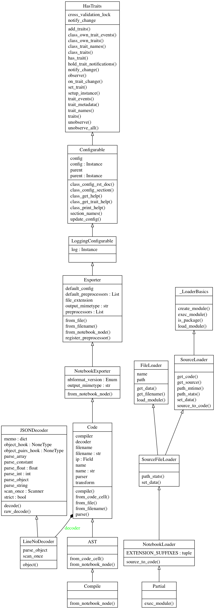

# `rites` is a new convention for the notebook

`rites` are IPython conventions for composing computable documents for humans.

## Conventions

### Notebooks should Restart and Run All

An out of order notebook has <big><big>🚫🙅🏼</big></big> value to the future.  I don't wanna hear it,
nope 🙉, a notebook that runs out of order is useless!

`rites` will import notebooks as source.  If a notebooks imports, then it will _generally_ restart and run all.

    import rites, rites.testing, rites.markdown
    assert all(_.__file__.endswith('.ipynb') for _ in (rites.testing, rites.markdown))

#### Expensive tasks?

Learn to use caching, parallel execution, optimization, or write better code.  `requests_cache` is useful.
    
### Program For The People

[Wilt Chamberlain]() holds the single season record for field percentage in the NBA 
at [0.727 in the 1972–73 season]().  No professional baseball player has ever had batting average 
over 0.500.  That sucks, you are to go to work everyday to fail better than others your peer.

> Programming shouldn't be as boring as baseball.

`rites.markdown` inspires literate programs written primarily in markdown; all code blocks
are evaluted are normal source code.  This convention drafts documents for you and your colleagues,
not computers.  Special care is take to provide the expected tracebacks in interactive mode. `rise.markdown`
will have you feeling all...

> Suppress the display by starting any cell with a blank line.

### Tests are the Future

* If a document is available on all machines, its readable.
* If a document executes on a few machines, it is reusable.
* If a document executes on many machines, it is reproducible.
* If a document works solely on your machine, its useless.

    #### Share your work! Your ideas are great!
    
Tests will future proof your ideas so other people and machines can use them.

`rites.testing` automates __doctest__, __unittest__, property based tests with __hypothesis__, and behavior
driven testing with __behave__.  Abide by a conventions in your functions and classes to trigger tests

#### FunctionTestCase and DocTest
    
    def test():
        """Functions without arguments are run as unittests
        >>> assert globals(), 'This ran in doctest.'
        
        The doctests are ran too.
        """
        assert True
---

    ..
    ----------------------------------------------------------------------
    Ran 2 tests in 0.005s
    
    OK

#### Unittest

    class Test(__import__('unittest').TestCase):
        def runTest(self):
            self.assertTrue
---

    .
    ----------------------------------------------------------------------
    Ran 1 test in 0.001s
    
    OK

In fact, any `class` containing a `runTest` method is as a FunctionTestCase.

    class meh:
        def runTest(self): assert issubclass(self, meh)
---            

    .
    ----------------------------------------------------------------------
    Ran 1 test in 0.002s
    
    OK

#### Propery based testing with *hypothesis*

__hypothesis__ will infer strategies for typed functions; typing functions is a good thing.

    ct = 0
    def f(i:int): 
        global ct
        ct += 1
        return i
---

    .
    ----------------------------------------------------------------------
    Ran 1 test in 0.197s
    
    OK

### The Narrative Should include real data

The function __f__ was executed __`100`__ times because could infer a testing strategy from the type annotations.

#### Notebooks should __import__

If one `rites.markdown` they may __import__ it.

You'll notice that `__name__ == '__main__'` has become a convention.  This statement separates
I(nteractive)Python from Python.
    
    o = __name__ == '__main__' # use o because it typographically l👀ks ok
    if o:
        import readme
        def _test_():
            assert readme.ct is 0
            assert readme.__complete__ is not True
            assert isinstance(readme.__complete__, AssertionError)
        
occurs in the Interactive context

        
    else:
        assert False
        
Otherwise, the module is being imported and we deliberately create an error.
        
        
        
        

    .
    ----------------------------------------------------------------------
    Ran 1 test in 0.001s
    
    OK

> Advanced users may figure out how to use notebooks at CLI's.
    

#### Tracebacks Are Important

`rites` provides valid tracebacks to the source notebook of an imported document.    
    
    if o: raise readme.__complete__

>> If you saved recently, then forget about it.

The output below illustrates a valid traceback to the `ipython-input` and python import, respectively.

---

    ---------------------------------------------------------------------------

    AssertionError                            Traceback (most recent call last)

    <ipython-input-12-e947bc94e5ba> in <module>()
          3 `rites` provides valid tracebacks to the source notebook of an imported document.
          4 
    ----> 5     if o: raise readme.__complete__
          6 
          7 >> If you saved recently, then forget about it.

    ~/rites/rites/rites.py in capture(loader, module)
        174     with capture_output() as output:
        175         try:
    --> 176             super(type(loader), loader).exec_module(module)
        177             module.__complete__ = True
        178         except BaseException as Exception:

    ~/rites/rites/template.ipynb in exec_module(Loader, module)

    ~/rites/rites/rites.py in from_file(Module, file_stream, resources, **dict)
         82         for str in ('name', 'filename'):
         83             setattr(Compile, str, dict.pop(str, getattr(Compile, str)))
    ---> 84         return Module.from_notebook_node(load(file_stream, cls=Module.decoder), resources, **dict)
         85 
         86     def from_filename(Module,  filename, resources=None, **dict):

    ~/rites/rites/rites.py in from_notebook_node(AST, nb, resource, **dict)
        115         module = ast.Module(body=[])
        116         for cell in nb.cells:
    --> 117             nodes = AST.from_code_cell(cell, **dict)
        118             nodes and module.body.extend(nodes.body)
        119         return ast.fix_missing_locations(module)

    ~/rites/rites/template.ipynb in from_code_cell(Incremental, cell, **dict)

    ~/rites/readme.ipynb in <module>()
        455     "        \n",
        456     "    else:\n",
    --> 457     "        assert False\n",
        458     "        \n",
        459     "Otherwise, the module is being imported and we deliberately create an error.\n",

    AssertionError: 

#### Everything Should Compute

Convert a document into other formats; Restart, Run All, `nbconvert`.

    if o:
        !jupyter nbconvert --to markdown --MarkdownExporter.exclude_input=True readme.ipynb
        !source activate p6 && pyreverse -o png -p rites -A rites

    [NbConvertApp] Converting notebook readme.ipynb to markdown
    [NbConvertApp] Writing 7045 bytes to readme.md
    parsing rites/__init__.py...
    parsing /Users/tonyfast/rites/rites/__init__.py...
    parsing /Users/tonyfast/rites/rites/all.py...
    parsing /Users/tonyfast/rites/rites/rites.py...
    Warning: Could not load "/Users/tonyfast/anaconda/envs/p6/lib/graphviz/libgvplugin_pango.6.dylib" - file not found
    Warning: Could not load "/Users/tonyfast/anaconda/envs/p6/lib/graphviz/libgvplugin_pango.6.dylib" - file not found
    Warning: Could not load "/Users/tonyfast/anaconda/envs/p6/lib/graphviz/libgvplugin_pango.6.dylib" - file not found
    Warning: Could not load "/Users/tonyfast/anaconda/envs/p6/lib/graphviz/libgvplugin_pango.6.dylib" - file not found
    Warning: Could not load "/Users/tonyfast/anaconda/envs/p6/lib/graphviz/libgvplugin_pango.6.dylib" - file not found
    Warning: Could not load "/Users/tonyfast/anaconda/envs/p6/lib/graphviz/libgvplugin_pango.6.dylib" - file not found

